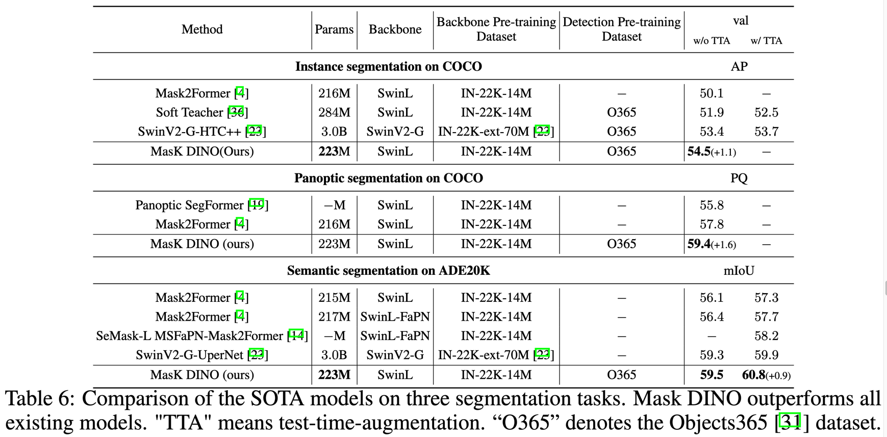
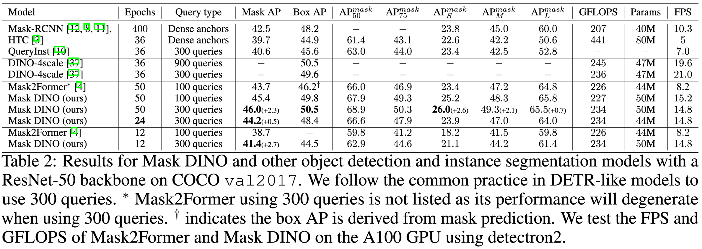
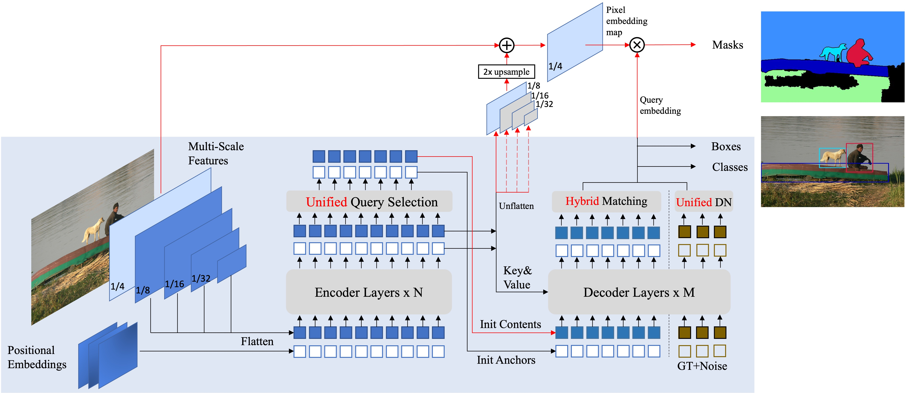

Mask DINO: Towards A Unified Transformer-based Framework for Object Detection and Segmentation
========

By [Feng Li*](https://fengli-ust.github.io/), [Hao Zhang*](https://scholar.google.com/citations?user=B8hPxMQAAAAJ&hl=zh-CN), Huaizhe xu, [Shilong Liu](https://www.lsl.zone/), [Lei Zhang](https://scholar.google.com/citations?hl=zh-CN&user=fIlGZToAAAAJ), [Lionel M. Ni](https://scholar.google.com/citations?hl=zh-CN&user=OzMYwDIAAAAJ), and [Heung-Yeung Shum](https://scholar.google.com.hk/citations?user=9akH-n8AAAAJ&hl=en).

This repository is an official implementation of the [Mask DINO: Towards A Unified Transformer-based
Framework for Object Detection and Segmentation]().  Code will be available soon, please stay tuned!

## News
[2022/5][DN-DETR](https://arxiv.org/abs/2203.01305) is accepted to CVPR 2022 as an **Oral** presentation. Code is now avaliable [here](https://github.com/IDEA-opensource/DN-DETR).

[2022/4][DAB-DETR](https://arxiv.org/abs/2201.12329) is accepted to ICLR 2022. Code is now avaliable [here](https://github.com/IDEA-opensource/DAB-DETR).

[2022/3]We release a SOTA detection model [DINO](https://arxiv.org/abs/2203.03605) that for the first time establishes a DETR-like model as a SOTA model on the [leaderboard](https://paperswithcode.com/sota/object-detection-on-coco). Code will be avaliable [here](https://github.com/IDEACVR/DINO).

[2022/3]We build a repo [Awesome Detection Transformer](https://github.com/IDEACVR/awesome-detection-transformer) to present papers about transformer for detection and segmentation. Welcome to your attention!

## Introduction

**Abstract**: In this paper we present Mask DINO, a unified object detection and segmentation framework. 
Mask DINO extends DINO (DETR with Improved Denoising Anchor Boxes) by adding a mask prediction branch which supports all image segmentation tasks (instance, panoptic, and semantic). 
It makes use of the query embeddings from DINO to dot-product a high-resolution pixel embedding map to predict a set of binary masks. 
Some key components in DINO are extended for segmentation through a shared architecture and training process. 
Mask DINO is simple, efficient, scalable, and benefits from joint large-scale detection and segmentation datasets. 
Our experiments show that Mask DINO significantly outperforms all existing specialized segmentation methods, both on a ResNet-50 backbone and a pre-trained model with SwinL backbone. 
Notably, Mask DINO establishes the best results to date on instance segmentation (**54.5** AP on COCO), panoptic segmentation (**59.4** PQ on COCO), and semantic segmentation (**60.8** mIoU on ADE20K).

## Resutls
### SOTA results on Instance, Panoptic, and Sementic Segmentation.
We have established the best results on all three segmentation tasks to date.

### Instance segementation and Object detection

### Panoptic segementation

### Semantic segementation

### For more experimental results and ablation study, please refer to our [paper]().
## Model
We build upon the object detection model [DINO:DETR with Improved DeNoising Anchor Boxes for End-to-End Object Detection](https://arxiv.org/abs/2203.03605) and extend it to segmentation tasks with minimal modifications.

## Links
Our work is based on [DINO](https://arxiv.org/abs/2203.03605) and is also closely related to previous work [DN-DETR]((https://arxiv.org/abs/2203.01305)) and [DAB-DETR](https://arxiv.org/abs/2201.12329).

<b>DINO: DETR with Improved DeNoising Anchor Boxes for End-to-End Object Detection.</b>
 
Hao Zhang*, Feng Li*, Shilong Liu*, Lei Zhang, Hang Su, Jun Zhu, Lionel M. Ni, Heung-Yeung Shum.
 
Arxiv 2022.
 
<a href='https://arxiv.org/abs/2203.03605'>[paper]</a> <a href='https://github.com/IDEACVR/DINO'>[code]</a>    

<b>DN-DETR: Accelerate DETR Training by Introducing Query DeNoising.</b>
 
Feng Li*, Hao Zhang*, Shilong Liu, Jian Guo, Lionel M. Ni, Lei Zhang.
 
IEEE Conference on Computer Vision and Pattern Recognition (<b>CVPR</b>) 2022. <b>Oral</b>.
 
<a href='https://arxiv.org/abs/2203.01305'>[paper]</a> <a href='https://github.com/FengLi-ust/DN-DETR'>[code]</a> <a href='https://www.zhihu.com/question/517340666/answer/2381304399'>[中文解读]</a>

<b>DAB-DETR: Dynamic Anchor Boxes are Better Queries for DETR.</b>
 
Shilong Liu, Feng Li, Hao Zhang, Xiao Yang, Xianbiao Qi, Hang Su, Jun Zhu, Lei Zhang.
 
International Conference on Learning Representations (<b>ICLR</b>) 2022.
 
<a href='https://arxiv.org/abs/2201.12329'>[paper]</a> <a href='https://github.com/SlongLiu/DAB-DETR'>[code]</a>    

## Bibtex
If you find our work helpful for your research, please consider citing the following BibTeX entry.   
> @article{li2022dn,  
  &emsp;&emsp;title={Mask DINO: Towards A Unified Transformer-based Framework for Object Detection and Segmentation},  
  &emsp;&emsp;author={Li, Feng and Zhang, Hao and Liu, Shilong and Guo, Jian and Ni, Lionel M and Zhang, Lei},  
  &emsp;&emsp;journal={arXiv preprint arXiv:2203.01305},  
  &emsp;&emsp;year={2022}   
}
